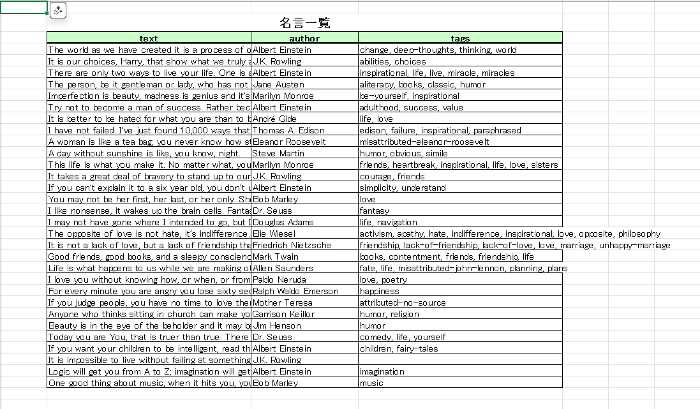
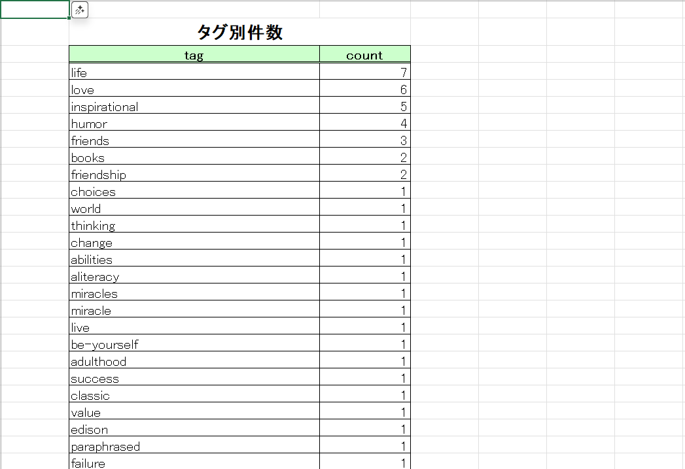

# Webスクレイピング：名言データ収集ツール

学習用サイト [Quotes to Scrape](https://quotes.toscrape.com) から  
名言・著者・タグをスクレイピングして **CSV / Excel（1ファイル・3シート）** に保存するサンプルです。

- ページネーション対応（次ページ巡回）
- レート制御（待機秒）でサイト負荷を低減
- 重複除去（名言×著者の組み合わせ）
- Excel は **A1空白・B2タイトル・ヘッダー薄緑・ヘッダー下二重線・表枠線・タイトル見切れ防止** の体裁で出力

---

## 機能一覧

- 🌐 **スクレイピング**：名言 (`text`), 著者 (`author`), タグ (`tags`)
- 📑 **ページ巡回**：最大ページ数を指定可能（`--max-pages`）
- 🕒 **レート制御**：ページ間スリープ（`--sleep`）
- 📊 **出力**：CSV（UTF-8 BOM） / Excel（`.xlsx`、1ファイル3シート）
- 🧹 **重複除去**：名言＋著者の組み合わせでユニーク化

---

## セットアップ

1. 仮想環境を作成して有効化  
   - **Windows**
     ```bash
     python -m venv venv
     venv\Scripts\activate
     ```
   - **macOS/Linux**
     ```bash
     python -m venv venv
     source venv/bin/activate
     ```

2. 必要ライブラリをインストール  
     ```bash
     pip install -r requirements.txt
     ```

---

## 使い方

1. 基本コマンド
    ```bash
    python scrape_quotes.py
    ```

2. オプション付き(推奨)
    ```bash
    # 例：最大3ページ、各ページ1秒待機、Excelレポートも出力
    python scrape_quotes.py --max-pages 3 --sleep 1 --excel
    ```

3. 出力
    ```bash
    ・output/quotes.csv
    ・output/quotes_report.xlsx（シート：名言一覧 / 著者別件数 / タグ別件数）
    ```
>⚠️ 注意：Excel を開いたまま実行すると保存できません。閉じてから再実行してください。

---

## Demo

実行ログ(例)

    $ python scrape_quotes.py --max-pages 3 --sleep 1 --excel
    [INFO] fetch page 1: https://quotes.toscrape.com
    [INFO] fetch page 2: https://quotes.toscrape.com/page/2/
    [INFO] fetch page 3: https://quotes.toscrape.com/page/3/
    [OK] CSV saved: output/quotes.csv
    [OK] Excel saved: output/quotes_report.xlsx


### 出力イメージ（Excel）

- **名言一覧**
  

- **著者別件数**

  

- **タグ別件数**

  

---

## フォルダ構成

```bash
web_scrape_quotes/
├─ scrape_quotes.py       # メインスクリプト
├─ README.md              # このファイル
├─ requirements.txt       # 依存ライブラリ
├─ .gitignore             # Git 無視設定
├─ docs/
│   └─ screenshots/
│       └─ quotes_report.png
└─ output/                # 生成データ
   ├─ quotes.csv
   └─ quotes_report.xlsx
```

---

## ライセンス
    MIT License

